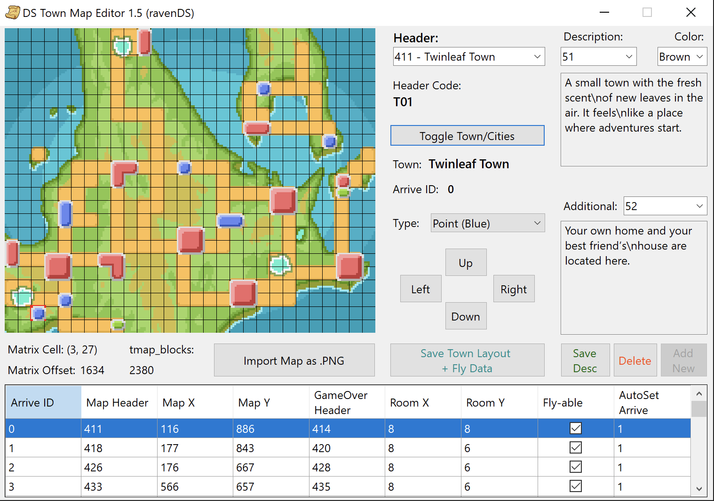
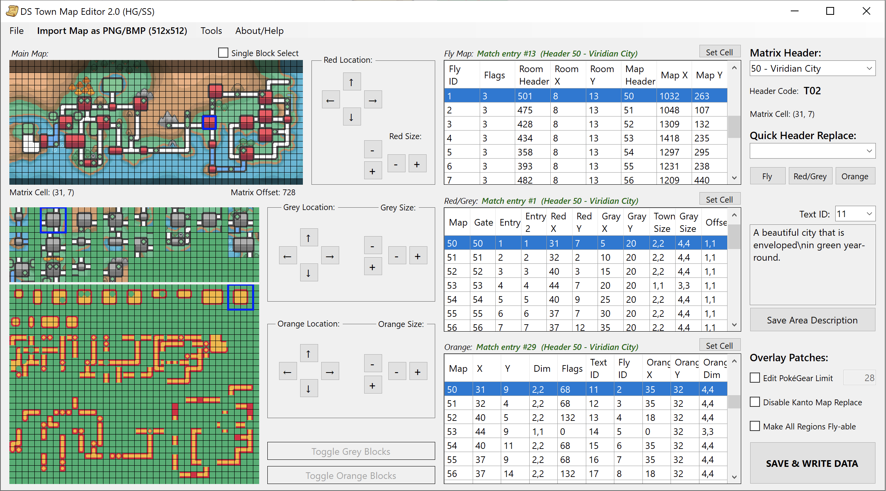

# DS Town Map Editor

A tool to edit Town positions, Fly Locations, and descriptions displayed on the D/P/Pt/HG/SS Town Map!

## Notes:
- <b>You might need to enable « High DPI Scaling Override »</b>
- To make a valid Fly Location, the Header must be both on the Matrix, in the Fly list and as an actual Town/City <b>(all 3)</b>
- Number of towns is limited by size of overlays
- Japanese ROMs are partly supported for DPPT **(Rev 6 only)**

